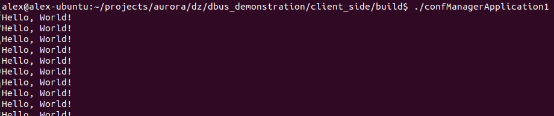
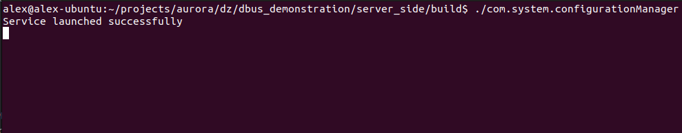
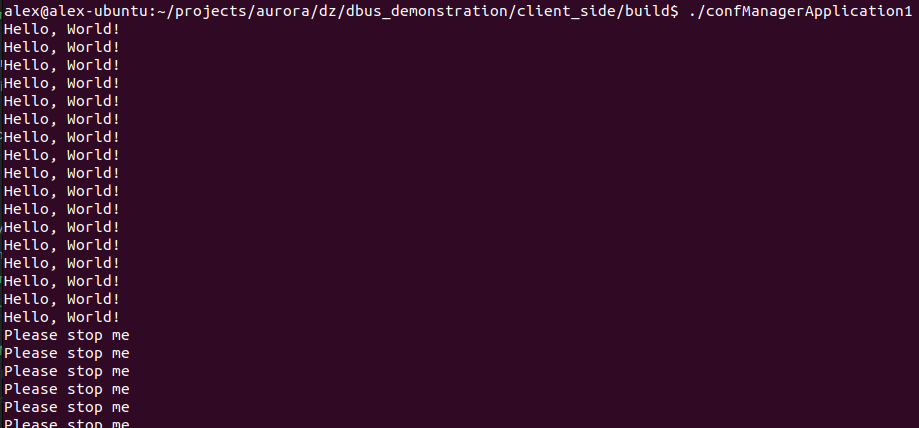
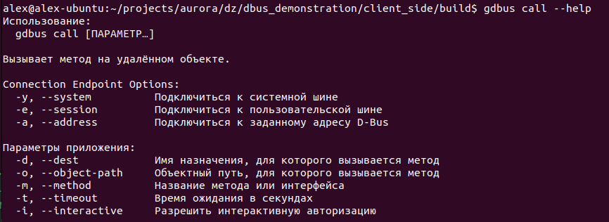
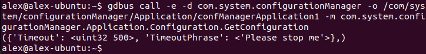

# D-Bus сервис _com.system.configurationManager_ и настраиваемое им приложение confManagerApplication1

## Инструкция по сборке

Под "**_dbus_demonstration/_**" будем понимать корневую папку проекта.

### Установка _sdbus-c++_
  
Если в вашей системе уже установлена библиотека **sdbus-c++**, то сразу переходите к установке сервиса и приложения.

Описываемая инструкция по установке библиотеки проверена на Ubuntu 22.04. Если у вас установлена другая ОС, то некоторые моменты могут отличаться от действий, описанных в этом пункте. Общая инструкция по установке приведена [здесь](https://github.com/Kistler-Group/sdbus-cpp/blob/master/docs/using-sdbus-c++.md#solving-sd-bus-dependency)

1. **Установка _systemd_**
    
    **sdbus-c++** - это обертка вокруг sd-bus, библиотеки C, которая была написана как часть проекта **systemd**.

    Для установки пакета выполните в терминале следующую команду:

   ```
   sudo apt install libsystemd-dev
   ```

2. **Установка _sdbus-c++_**

   Воспользуемся пакетным менеджером **Conan**. Для этого сначала установим его:
   
   ```
   pip install conan
   ```
   
   Далее сгенерируем **профиль Conan**, основанный на текущей операционной системе и установленных инструментах:

   ```
   conan profile detect --force
   ```
   
   Для установки **sdbus-c++** и генерации файлов, необходимых **CMake** для поиска этой библиотеки и сборки проекта, откроем терминал в директории проекта "**_dbus_demonstration/conan_**", где лежит "**_conanfile.txt_**", и выполним следующую команду:

   ```
   conan install . --output-folder=build --build=missing
   ```
   
После успешного выполнения всех действий библиотека появится в системе и будет доступна для подключения в проект через **CMake** с помощью команды "**_find_package(sdbus-c++ REQUIRED)_**".


### Установка сервиса _com.system.configurationManager_

Под сервисом будем понимать приложение, которое запускает сервис **D-Bus** с именем "**_com.system.configurationManager_**"

1. Перейдите в терминале в директорию "**_dbus_demonstration/server_side_**", создайте папку **_build_** для сборки проекта и перейдите в нее:

   ```
   mkdir build
   cd build
   ```

2. Далее выполните сборку сервиса с помощью следующих команд **CMake** (если для установки библиотеки **sdbus-c++** вы не использовали **Conan**, то опции первой команды будут другие или вообще будут отсутствовать):

   ```
   cmake .. -DCMAKE_TOOLCHAIN_FILE=../../conan/build/build/Release/generators/conan_toolchain.cmake -DCMAKE_BUILD_TYPE=Release
   cmake --build . --target install --config Release
   ```
   
   Опция "**--target install**" выполнит создание директории "**_~/com.system.configurationManager_**"

Если все было выполнено без ошибок, в директории "**_dbus_demonstration/server_side/build_**" будет лежать исполняемый файл "**_com.system.configurationManager_**"

### Установка приложения confManagerApplication1

1. Перейдите в терминале в директорию "**_dbus_demonstration/client_side_**", создайте папку **_build_** для сборки проекта и перейдите в нее:

   ```
   mkdir build
   cd build
   ```

2. Далее выполните сборку приложения с помощью следующих команд **CMake** (если для установки библиотеки **sdbus-c++** вы не использовали **Conan**, то опции первой команды будут другие или вообще будут отсутствовать):

   ```
   cmake .. -DCMAKE_TOOLCHAIN_FILE=../../conan/build/build/Release/generators/conan_toolchain.cmake -DCMAKE_BUILD_TYPE=Release
   cmake --build . --target install --config Release
   ```
   
   Опция "**--target install**" выполнит установку конфигурационного файла приложения "**_confManagerApplication1.json_**" в директорию "**_~/com.system.configurationManager_**"

Если все было выполнено без ошибок, в директории "**_dbus_demonstration/client_side/build_**" будет лежать исполняемый файл "**_confManagerApplication1_**"


## Инструкция по использованию

Рассматриваемый пример подразумевает наличие конфигурационного файла приложения "**_~/com.system.configurationManager/confManagerApplication1.json_**"

1. Откройте терминал, перейдите в директорию "**_dbus_demonstration/client_side/build_**" и запустите приложение **confManagerApplication1** командой:
   
   ```
   ./confManagerApplication1
   ```

   После запуска в консоли каждую секунду будет печататься сообщение "**Hello, World!**". Это значение и время задержки в одну секунду было считано из конфигурационного файла "**_~/com.system.configurationManager/confManagerApplication1.json_**"

   Скриншот вывода:
   
   


2. Откройте терминал, перейдите в директорию "**_dbus_demonstration/server_side/build_**" и запустите сервис **com.system.configurationManager** командой:
   
   ```
   ./com.system.configurationManager
   ```

   После запуска в консоли выведется сообщение "**Service launched successfully**", что сигнализирует от том, что сервис **com.system.configurationManager** был успешно запущен

   Скриншот вывода:
   
   


3. **Пример 1.** Давайте изменим выводимую приложением **confManagerApplication1** фразу. Для этого откройте еще один терминал и выполните команду **gdbus**:
   
   ```
   gdbus call -e -d com.system.configurationManager -o /com/system/configurationManager/Application/confManagerApplication1 -m com.system.configurationManager.Application.Configuration.ChangeConfiguration "TimeoutPhrase" "<'Please stop me'>"
   ```
   
   Эта команда вызывает метод **ChangeConfiguration** интерфейса **com.system.configurationManager.Application.Configuration** на объекте, путь которого - "**/com/system/configurationManager/Application/confManagerApplication1**"

   После этого выводимая фраза в консоль приложения **confManagerApplication1** изменится:

   


**P.S.** Выполнить команду из переданного мне задания я не могу, так как там присутствуют ошибки:
1. Команды "**gdbus send**" не существует: есть только команда "**gdbus call**", которая предназначена для вызова методов на объекте **D-Bus**, и команда "**dbus-send**", но по именам передаваемых в команду опций, я понял, что имеется ввиду команда "**gdbus call**"
2. Объекты идентифицируются не по имени (т.е. не через точку, как сервис), а по пути (т.е. через слеш). Т.е. вместо "**com.system.configurationManager.Application.confManagerApplication1**" нужно писать "**/com/system/configurationManager/Application/confManagerApplication1**"
3. При указании метода, сначала пишется имя интерфейса, затем точка, а затем имя метода. Т. е. для метода **ChangeConfiguration** полное имя будет "**com.system.configurationManager.Application.Configuration.ChangeConfiguration**", а не "**com.system.configurationManager.Application.ChangeConfiguration**"
4. Передаваемый аргумент типа Variant указывается в угловых скобках. Т.е. вместо **"s 'Please stop me' "** должно быть **"<'Please stop me'>"**

Может быть в системе, для которой в задании писалась команда, имеет свою специфичную реализацию команды "**gdbus**", но это было бы максимально странно. На ОС Ubuntu **gdbus** стандартный. Вот спецификация на [gdbus](https://manpages.ubuntu.com/manpages/focal/man1/gdbus.1.html) и [dbus-dend](https://dbus.freedesktop.org/doc/dbus-send.1.html). Вот еще скриншот с опциями команды "**gdbus call**":




4. **Пример 2.** Давайте изменим задержку вывода фразы. Для этого выполним команду:
   
   ```
   gdbus call -e -d com.system.configurationManager -o /com/system/configurationManager/Application/confManagerApplication1 -m com.system.configurationManager.Application.Configuration.ChangeConfiguration "Timeout" "<uint32 500>"
   ```

   После этого задержка вывода фразы в консоль приложения **confManagerApplication1** изменится с 1с на 0.5с


5. **Пример 3.** Давайте посмотрим текущую конфигурацию приложения. Для этого выполним команду:
   
   ```
   gdbus call -e -d com.system.configurationManager -o /com/system/configurationManager/Application/confManagerApplication1 -m com.system.configurationManager.Application.Configuration.GetConfiguration
   ```

   Результат выполнения команда:

   


6. Завершить работу сервиса **com.system.configurationManager** и приложения **confManagerApplication1** можно с помощью нажатия комбинации клавиш "**Ctrl+C**"


## Особенности приложения и сервиса

1. При вызове метода на объекте сервис может вернуть ошибку в случае, если переданы аргументы неверного типа или если не удалось прочитать файл конфигурации приложения

2. Сервис предоставляет у объектов интерфейс **com.system.configurationManager.Application.Configuration**, включающий:
   1. Метод **_void ChangeConfiguration(key: string, value: variant)_**, который изменяет определенный параметр для приложения;
   2. Метод **_map<string, variant> GetConfiguration()_**, который возвращает полную конфигурацию приложения
   3. Сигнал _**сonfigurationChanged(configuration: dict)**_, где "**dict**" является D-Bus типом "**a{sv}**" (в библиотеке **sdbus-c++** этот тип соответствует типу **_std::map<std::string, sdbus::Variant>_**, вот ссылка на [источник](https://github.com/Kistler-Group/sdbus-cpp/discussions/445) (там спрашивают про тип "**a(sa{sv})**", поэтому понять чему соответствует **a{sv}** не сложно))

3. Приложение **confManagerApplication1** может быть запущено до запуска сервиса, и приложение все равно подключится к сервису после его запуска

4. Если при запуске приложения **confManagerApplication1** файл "**_~/com.system.configurationManager/confManagerApplication1.json_**" отсутствует или он не корректен, т.е. невозможно прочитать его как **json** или отсутствует один из двух параметров, то приложение будет запущено с конфигурацией по умолчанию (задержка: 1с, фраза: "_Default text_")
